<p align="center">
  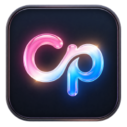
</p>

<h1 align="center">CoPanel</h1>

<p align="center">
  <b>Trình quản lý máy chủ game trên Windows</b><br />
  Kết nối trực tiếp tới panel <b>Pterodactyl</b> và <b>Calagopus</b> bằng Client API Key
</p>

<p align="center">
  
  
  
  
  
  
  
</p>

---

## Giới thiệu

**CoPanel** là ứng dụng desktop giúp bạn quản lý máy chủ game (Minecraft, …) ngay trên Windows — thay vì phải mở trình duyệt vào panel, mọi thứ nằm gọn trong một cửa sổ: console, tệp tin, sao lưu, lịch trình, người chơi và cả **kho đồ** của từng người chơi.

Ứng dụng là **client thuần**: mọi dữ liệu được đọc trực tiếp từ panel của bạn qua API. CoPanel không có máy chủ trung gian, không thu thập dữ liệu, không lưu trữ máy chủ.

Đăng nhập chỉ cần **địa chỉ panel + Client API Key** — không cần nhập mật khẩu.

## Tính năng

**Kết nối & tổng quan**

- Hỗ trợ hai loại panel: **Pterodactyl** (`ptlc_…`) và **Calagopus** (`c7sp_…`), tự nhận diện khác biệt API.
- Quản lý nhiều máy chủ, chuyển server nhanh ngay trên sidebar (danh sách mở rộng ngay trong thanh điều hướng).
- Trang Tổng quan: trạng thái, RAM / CPU / Disk / TPS dạng đồng hồ, lưu lượng mạng, lịch sử hoạt động.
- Bật / tắt / khởi động lại / kill trực tiếp từ thanh trên.

**Console**

- Log thời gian thực qua WebSocket, gửi lệnh, tìm kiếm trong console, chỉnh cỡ chữ.
- Tự kết nối lại khi mất mạng.

**Quản trị máy chủ**

- **Tệp tin**: duyệt thư mục, tải lên / tải xuống, nén – giải nén, chmod, copy / move, tạo tệp và thư mục.
- **Cơ sở dữ liệu**: tạo, xoá, xoay mật khẩu, xem host kết nối.
- **Sao lưu**: tạo, tải về, khoá, khôi phục (tuỳ chọn xoá toàn bộ thư mục trước khi khôi phục).
- **Lịch trình**: cron, nhiều task mỗi lịch trình, chạy thử.
- **Mạng**: bảng phân bổ cổng (allocations), đặt cổng chính.
- **Khởi động**: biến môi trường (startup variables), docker image, đổi tên, cài đặt lại.
- **Người dùng phụ**: tạo, phân quyền chi tiết theo từng nhóm quyền của panel.

**Người chơi (Minecraft)**

- Danh sách người chơi đọc từ dữ liệu thế giới (`playerdata`, `usercache`, `ops`, `whitelist`, `banned-players`) kèm avatar skin.
- Số người đang online lấy từ **Server List Ping** bên ngoài — không phụ thuộc console.
- **Kho đồ**: mở kho đồ của player bằng lưới 9×4 đúng kiểu Minecraft (kèm giáp và tay trái), **give / xoá vật phẩm** với ảnh texture thật. Ghi trực tiếp vào file NBT của player, **tự tạo bản sao lưu trước khi ghi** và chặn ghi khi player đang online để tránh mất dữ liệu.
- Thao tác nhanh: OP / DeOP, whitelist, kick, ban; xoá dữ liệu người chơi (dữ liệu / thống kê / advancements).

**Giao diện**

- Chế độ Sáng / Tối với hiệu ứng chuyển nền; Tiếng Việt / English.
- Tooltip, icon và hiệu ứng chuyển trang đồng bộ trên toàn ứng dụng.

**Chế độ Demo**

- Chưa có panel vẫn xem được toàn bộ giao diện với dữ liệu mẫu — bấm **Dùng thử ngay** ở màn hình kết nối.

## Ảnh chụp màn hình

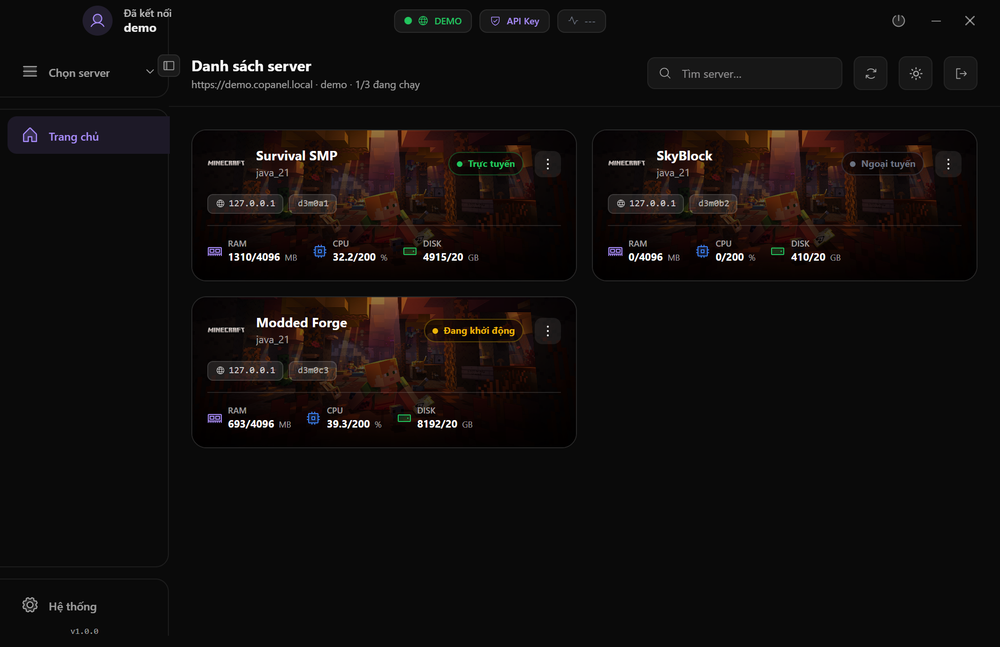

|  |  |
|:---:|:---:|
| 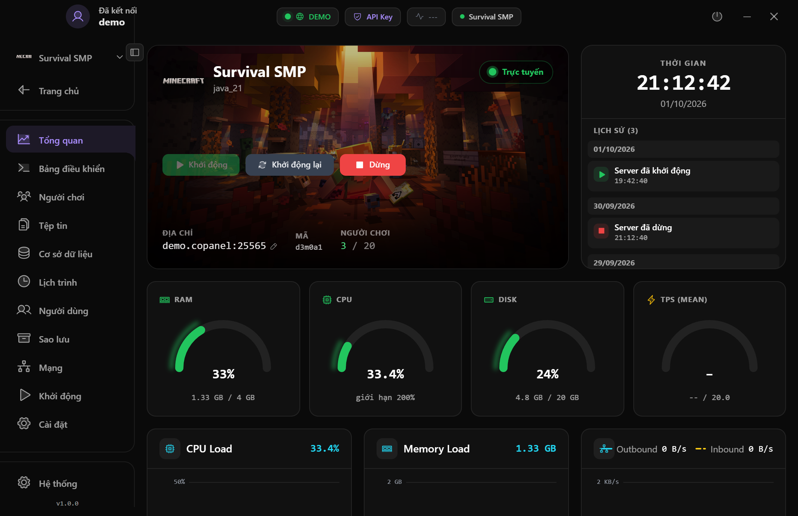 | 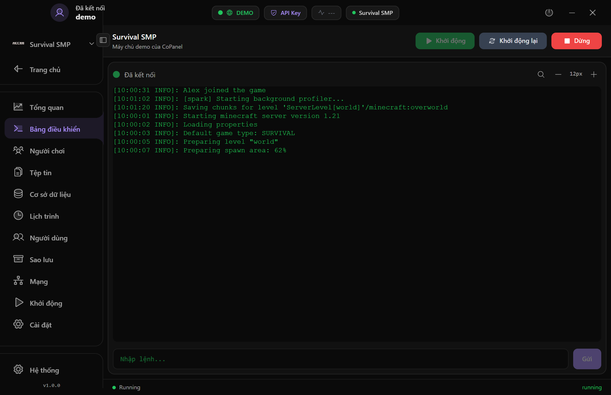 |
| 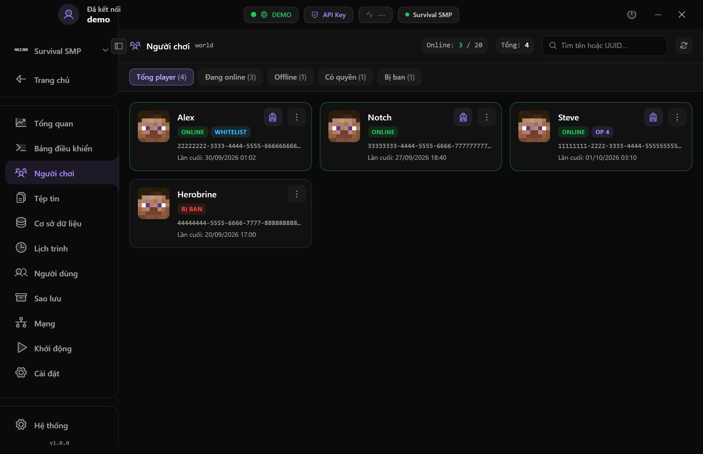 | 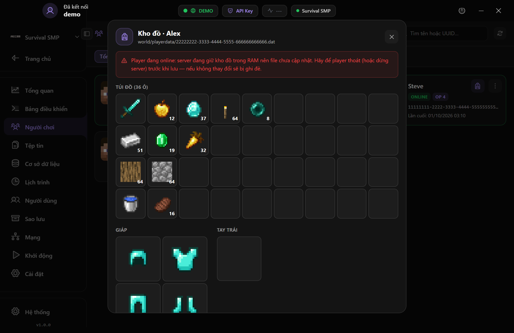 |
| 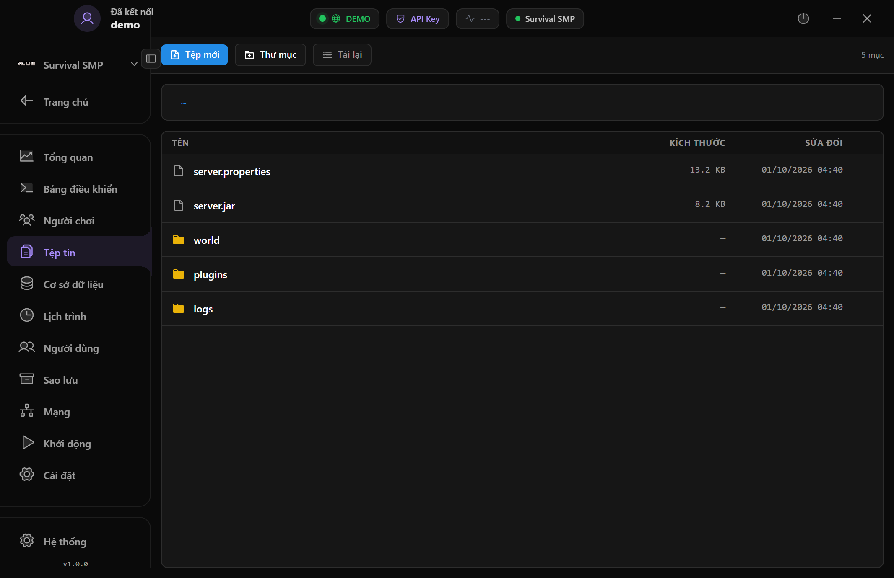 | 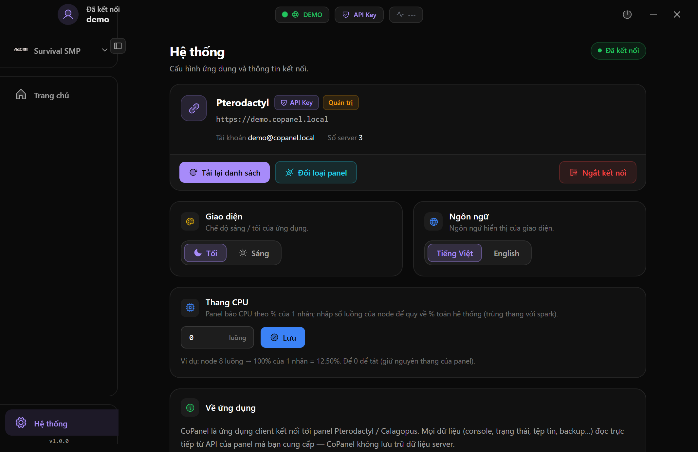 |

<p align="center">
  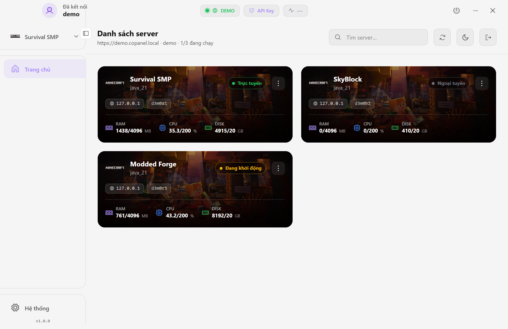
  <br /><i>Giao diện sáng</i>
</p>

## Bắt đầu

### 1. Kết nối panel

| Chọn loại panel | Nhập địa chỉ & API Key |
|:---:|:---:|
| 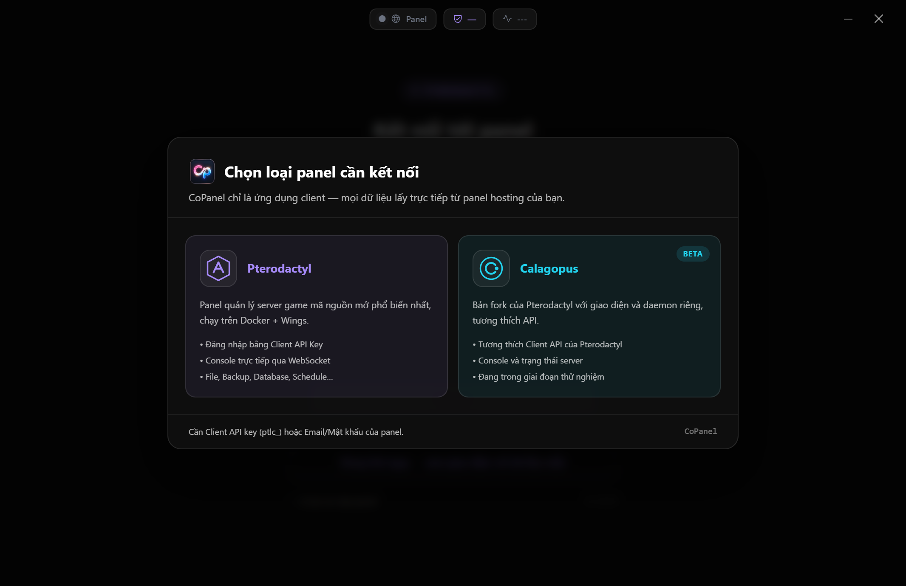 | 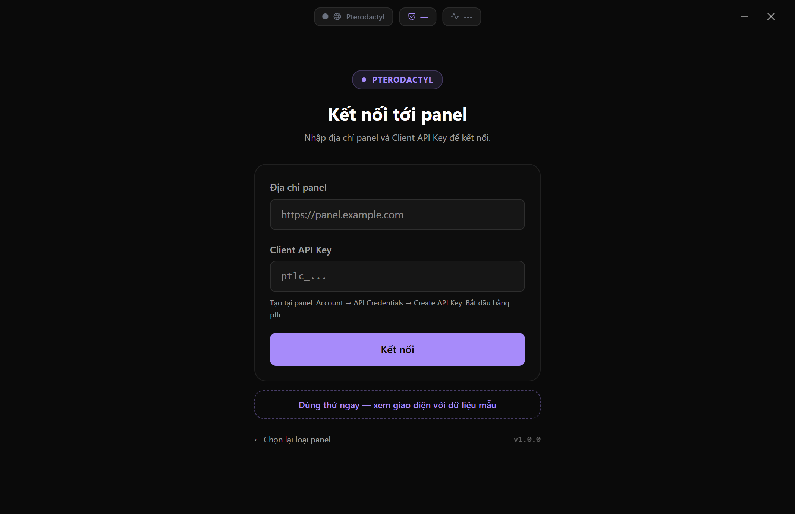 |

1. Mở CoPanel và chọn loại panel — **Pterodactyl** hoặc **Calagopus**.
2. Tạo Client API Key trên panel:
   - **Pterodactyl**: `Account` → `API Credentials` → `Create API Key` (key bắt đầu bằng `ptlc_`).
   - **Calagopus**: `Tài khoản` → `API Keys` → `Create` (key dài 48 ký tự, bắt đầu bằng `c7sp_`) — nhớ cấp quyền cho key, tối thiểu `servers.read`.
3. Nhập địa chỉ panel + key rồi nhấn **Kết nối**. Key được lưu trên máy, mã hoá bằng khoá của hệ điều hành.

### 2. Tải & cài đặt

Tải bộ cài Windows tại mục **Releases**:

- `CoPanel Setup x.y.z.exe` — trình cài đặt (kèm trang điều khoản sử dụng).
- `CoPanel x.y.z.exe` — bản chạy trực tiếp, không cần cài.

### 3. Tự build từ mã nguồn

Yêu cầu: **Node.js 20+** trên Windows.

```bash
git clone https://github.com/foxstudio-201/CoPanel.git
cd CoPanel
npm install

# Chạy thử ở chế độ phát triển (Vite + Electron)
npm run electron:dev

# Đóng gói bộ cài đặt vào dist-electron/ (NSIS + portable)
npm run electron:build
```

## Yêu cầu hệ thống

| | |
|---|---|
| Hệ điều hành | Windows 10 / 11 (64-bit) |
| Panel | Pterodactyl hoặc Calagopus (bản có Client API) |
| Node.js | Chỉ cần khi tự build từ mã nguồn |

## Công nghệ

| Thành phần | Công nghệ |
|---|---|
| Khung ứng dụng | Electron 44 |
| Giao diện | React 19 · Tailwind CSS v4 · Vite 8 |
| Console | xterm.js (fit / search / unicode11) |
| Kết nối | HTTPS (panel API) · WebSocket (console) · TCP Server List Ping (số người online) |
| Kho đồ | Trình đọc/ghi NBT thuần JS — round-trip giữ nguyên byte gốc, gzip qua Web Streams |

## Cấu trúc thư mục

```
electron/           # main process + preload (IPC, cửa sổ, tải tệp)
src/
  api/              # client Pterodactyl/Calagopus, demo, session, players, NBT
  components/       # sidebar, các trang server, modal, UI dùng chung
  lib/              # nbt, themeWipe, toast, tiện ích
build-resources/    # cấu hình NSIS + điều khoản sử dụng
docs/               # tài liệu API + ảnh chụp màn hình
```

## Bảo mật & quyền riêng tư

- Không có máy chủ trung gian — mọi yêu cầu đi thẳng từ máy bạn tới panel.
- Client API Key chỉ lưu trên máy, mã hoá bằng khoá của hệ điều hành.
- Không thu thập, không gửi dữ liệu của bạn cho bên thứ ba.
- URL tải tệp ký sẵn (signed URL) được gọi **không kèm API key**, tránh lộ key cho node.

## Điều khoản sử dụng

CoPanel miễn phí cho mục đích hợp pháp. Vui lòng đọc [điều khoản sử dụng & trách nhiệm](build-resources/license_vi.txt) trước khi sử dụng.

## Liên kết

- GitHub: https://github.com/foxstudio-201/CoPanel
